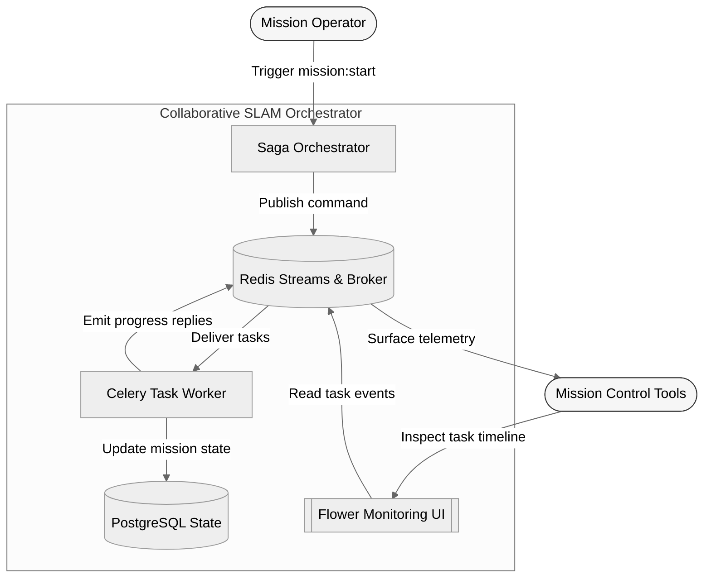
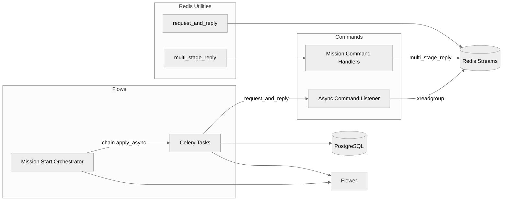
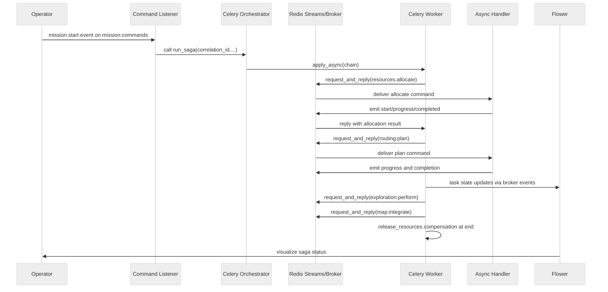

# High-Level Architecture

This document summarizes the architecture of the Collaborative SLAM Exploration proof-of-concept. The PoC demonstrates how a Celery-driven saga orchestrates Redis stream based command handlers to coordinate multi-robot exploration workflows.

## System Context

The solution is triggered when an external operator emits a `mission:start` command. The asynchronous command listener routes the event to the saga orchestrator, which dispatches Celery tasks and compensations through Redis. Handlers emit multi-stage progress updates so that mission control can observe state through Flower and the Redis replies stream.

### Key Responsibilities

- **Saga Orchestrator** – Builds the Celery canvas that sequences mission tasks and compensations. 【F:app/flows/mission_start_celery/orchestrator.py†L21-L56】
- **Celery Worker** – Hosts mission tasks and their compensating actions, delegating execution to Redis stream command handlers. 【F:app/flows/mission_start_celery/tasks.py†L13-L87】
- **Command Listener** – Discovers handler modules dynamically and consumes Redis streams to invoke them. 【F:app/commands/listener.py†L15-L113】
- **Redis Utilities** – Provide request/reply behavior and multi-stage progress reporting for handlers. 【F:app/redis_utils/decorators.py†L1-L58】
- **Monitoring** – Flower attaches to the Redis broker to visualize task life cycles.

## Component Structure

The PoC is organized into well-defined layers: orchestration flows, task definitions, command handlers, and Redis utilities. The following component diagram highlights the internal structure.

### Interaction Notes

1. The orchestrator chains mission steps with compensations using Celery's canvas primitives. 【F:app/flows/mission_start_celery/orchestrator.py†L27-L50】
2. Each task translates Celery calls into Redis stream requests handled by async listeners. 【F:app/flows/mission_start_celery/tasks.py†L18-L75】
3. Handlers leverage the `multi_stage_reply` decorator to send start, progress, completed, and failed events. 【F:app/redis_utils/decorators.py†L9-L58】【F:app/commands/handlers/plan_route.py†L1-L25】
4. The listener manages consumer groups and ack loops to scale independently. 【F:app/commands/listener.py†L42-L108】

## Saga Execution Sequence

The diagram below shows how a successful mission start flows through the system. Failure paths trigger compensations by linking Celery error callbacks; this behavior mirrors the same message exchanges with compensation tasks.

### Failure Handling

- Each saga step attaches a `link_error` callback that enqueues compensating Celery tasks when a downstream task fails. 【F:app/flows/mission_start_celery/orchestrator.py†L32-L49】
- Handlers surface failure details in the Redis reply stream, enabling upstream retries or abort logic.

## Deployment Considerations

- All services run inside Docker Compose with Redis, PostgreSQL, Celery workers, and Flower containers.
- The orchestrator waits for Redis availability at startup to avoid race conditions. 【F:app/celery_app.py†L13-L30】
- Command listeners register consumer groups idempotently, making scaling straightforward. 【F:app/commands/listener.py†L64-L92】

## Observability

- Flower consumes Celery events from Redis, providing task-level insight.
- Redis reply streams include structured progress percentages and payloads for mission dashboards.

